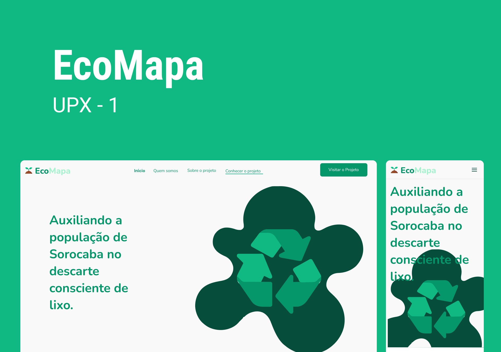

  <a href="#-tecnologias">Tecnologias</a>&nbsp;&nbsp;&nbsp;|&nbsp;&nbsp;&nbsp;
  <a href="#-projeto">Projeto</a>&nbsp;&nbsp;&nbsp;|&nbsp;&nbsp;&nbsp;
  <a href="#-layout">Layout</a>&nbsp;&nbsp;&nbsp;|&nbsp;&nbsp;&nbsp;

  

## 🚀 Tecnologias

Esse projeto foi desenvolvido com as seguintes tecnologias:

- HTML
- CSS
- JavaScript

Bibliotecas

- [Google Fonts](https://fonts.google.com/)
- [ScrollReveal](https://scrollrevealjs.org)

Utilitários

- [IonIcon](https://ionic.io/ionicons)

## 💻 Projeto

Esta é a Landing Page do Projeto de UPX-1 do 1º Semestre do curso de Análise e Desenvolvimento de Sistemas do Centro Universitário FACENS.

## 🔖 Layout

Você pode visualizar o layout do projeto através [desse link](https://www.figma.com/design/MwHud1W6VU2tIVIDShJSce/EcoMapa-LandingPage?node-id=120-21&t=Ow3QPhC7EDOUachK-0). É necessário ter conta no [Figma](https://figma.com) para acessá-lo.